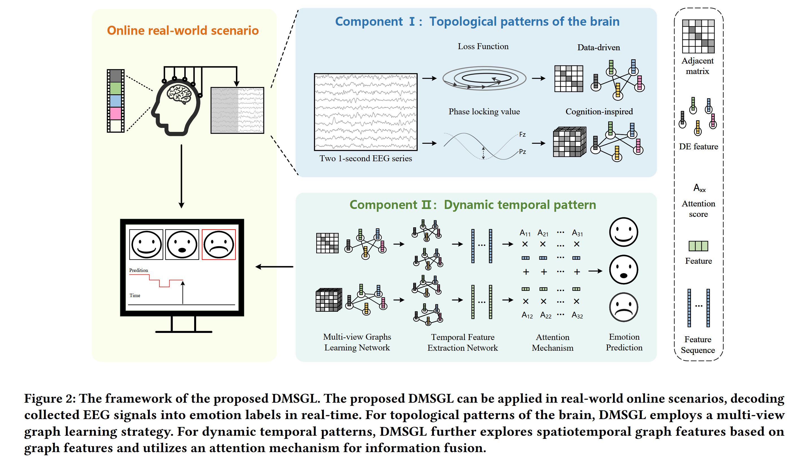
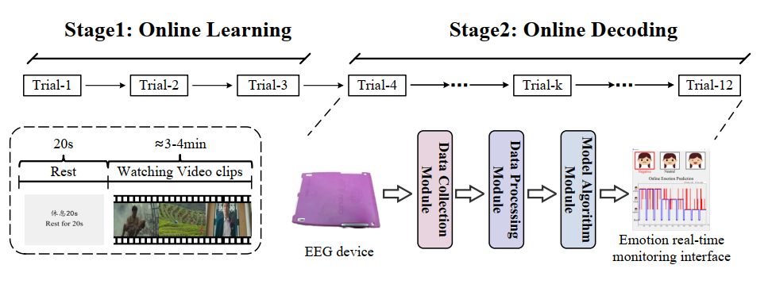

# DMSGL: Real-Time EEG Emotion Recognition from Dynamic Mixed Spatiotemporal Graph Learning
This repository contains the official implementation of the paper "Real-Time EEG Emotion Recognition from Dynamic Mixed Spatiotemporal Graph Learning" accepted in ACMMM 2025.
# Overview
Due to the uncertainty and individual specificity of emotional cognition, **there are still some challenges in achieving efficient online emotion decoding applications**. First, how to effectively leverage the topological patterns of the brain during emotional processing remains a significant challenge. Second, the process of collecting emotional EEG data is time-consuming and involves several steps. As a result, a common issue in existing studies is that the validity of EEG decoding models is typically validated only in offline scenarios, with limited verification of their application in real-world online environments.To address this, in this work, **we propose an online emotion decoding method named DMSGL (Real-Time EEG Emotion Recognition from Dynamic Mixed Spatiotemporal Graph Learning)**. With the DMSGL, the topological patterns and the stable dynamic temporal patterns existing in emotional EEG signals can be captured, and the real-time online emotion monitoring application can be implemented. The main contributions of this work are as follows:
- To model the complex brain connection network, we propose to utilize multi-view graph learning. Learning complementary graph structures from EEG signals.
- For the dynamic temporal patterns, DMSGL employs a dynamic mixed spatiotemporal graph network. Extracting spatiotemporal graph features from the graph features, and fusing the two branches to obtain robust representations.
- Based on this framework, we conduct extensive real-time emotion recognition experiments. The experimental results show that the proposed DMSGL can be effectively applied to real-time EEG emotion recognition.

### Framework

### The paradigm of online emotion decoding experiment

